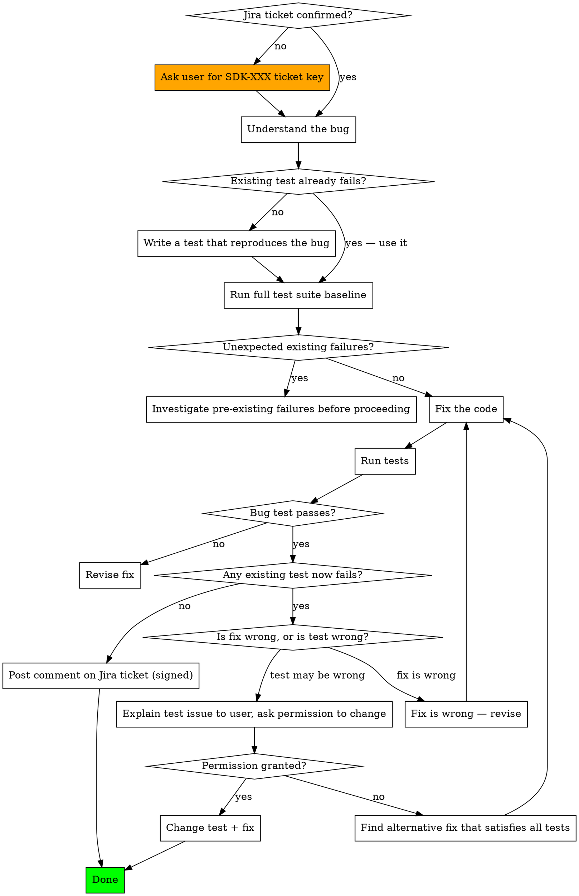

# Bug Fix Workflow for nJAMS SDK

## Overview

Existing test cases are the authoritative definition of correct behavior. They must never be changed to make a fix compile or pass — that hides bugs rather than fixing them. If a fix is impossible without changing a test, the situation must be understood and the user must decide.

This workflow builds on `njams-safe-modification`: the same test coverage and public API rules apply. A bug fix is a code change like any other.

## Hard Rules

**Every bug fix must be linked to a Jira ticket in the SDK project** (https://salesfive.atlassian.net, space key `SDK`). Before starting any fix, confirm the ticket key (e.g. `SDK-123`). If no ticket exists, ask the user to create one or provide the key. All commits for this fix must use the Jira Smart Commits format:
```
SDK-123 #comment <description>
```

**Never modify an existing test case without explicit user permission.** If your fix causes an existing test to fail, the fix is wrong — not the test. Stop and reconsider the approach.

**If you believe a test case is incorrect**, do not change it unilaterally. Write out:
1. Which test is affected and what it asserts
2. Why you believe the assertion is wrong or outdated
3. What the correct behavior should be and why

Then ask the user for permission. If permission is denied, find an alternative fix that satisfies all existing tests.

**Reproducing the bug with a test comes before fixing it.** Write or identify a failing test that demonstrates the bug first. This test becomes the target: the fix is complete when it passes and nothing else breaks.

## Workflow



## Steps in Detail

**1. Confirm the Jira ticket.**
Every bug fix must have a corresponding ticket in the SDK Jira project (https://salesfive.atlassian.net, space key `SDK`). If the user has not provided a ticket key, ask before proceeding. The ticket key (e.g. `SDK-123`) must be referenced in all commit messages for this fix.

**2. Understand and reproduce the bug.**
Before touching any code, clearly identify: what is the unexpected behavior, what is the expected behavior, and under what conditions it occurs.

**3. Find or write a failing test.**
Check whether an existing test already captures the failure. If not, write one that fails in the way the bug manifests. Run it to confirm it fails for the right reason.

**4. Establish a full baseline.**
```bash
mvn test -pl njams-sdk
```
Record which tests pass and fail before your change. Do not proceed if there are unexpected pre-existing failures you don't understand.

**5. Fix the code.**
Implement the smallest change that fixes the bug. Follow `njams-safe-modification` rules: do not change public API without permission, add test coverage for any untested code you touch.

**6. Verify.**
```bash
mvn test -pl njams-sdk
```
The bug test must now pass. Every test that passed in step 4 must still pass.

**7. If an existing test fails.**
Stop. Do not change the test. Analyze: does the test assert behavior your fix genuinely violates, or is the test wrong? Almost always the fix is wrong — revise it. Only if you have a clear, articulable reason why the test is incorrect should you escalate to the user.

**8. Comment on the Jira ticket.**
Once the fix is confirmed successful, post a short comment on the Jira ticket explaining what was wrong and how it was fixed. Use the Atlassian MCP tool to post the comment. Every comment posted to Jira must end with the Claude Code signature:

```
---
_Generated by Claude Code_
```

The comment should cover:
- Root cause of the bug (what was wrong and why)
- What was changed to fix it
- How the fix was verified (test added/used)

Keep it concise — two to five sentences is sufficient.

## When Escalating About a Test

Provide all three of these before asking:
- **What the test asserts** (paste the relevant assertion)
- **Why it conflicts** with the correct fix (specific technical reason)
- **What the correct behavior should be** and why the test got it wrong

Vague reasons ("the test seems outdated") are not sufficient. If you cannot articulate a precise reason, the fix is wrong.

## Common Mistakes

| Mistake | Correct Approach |
|---------|-----------------|
| Changing a test to make the fix pass | Stop — the fix is wrong; revise the implementation |
| Fixing without a reproducing test first | Write the failing test before writing any fix |
| Assuming a pre-existing test failure is unrelated | Understand all failures before proceeding |
| "The test was probably written incorrectly" | Articulate exactly why and ask the user |
| Fixing the symptom without understanding the cause | Understand root cause before changing code |
