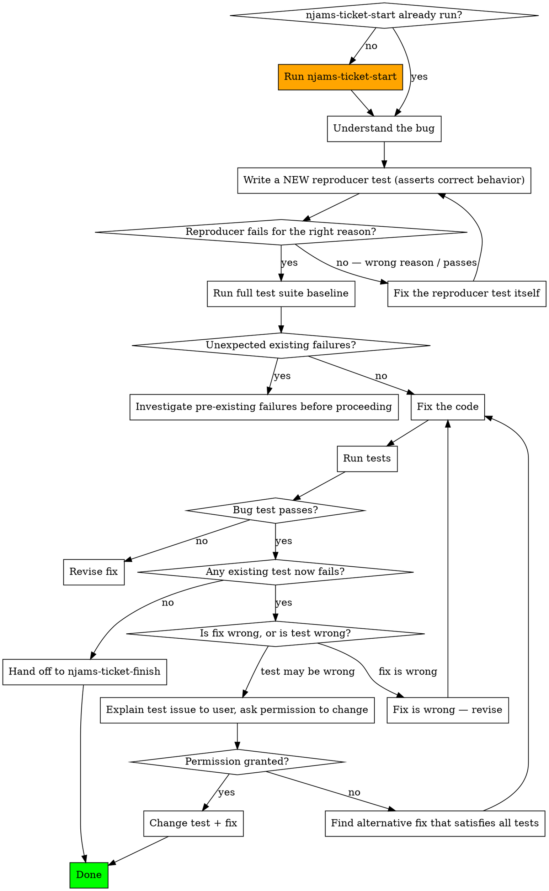

# Bug Fix Workflow for nJAMS SDK

## Overview

Existing test cases are the authoritative definition of correct behavior. They must never be changed to make a fix compile or pass — that hides bugs rather than fixing them. If a fix is impossible without changing a test, the situation must be understood and the user must decide.

This workflow builds on `njams-safe-modification`: the same test coverage and public API rules apply. A bug fix is a code change like any other.

Ticket kickoff (confirming the key, transitioning to In Progress, assigning) is handled by `njams-ticket-start` — run that first. Commit formatting is handled by `njams-commit`. Closing the ticket out (deciding the breaking-change label against the real diff, signed comment, resolution) is handled by `njams-ticket-finish` once the fix is verified.

## Hard Rules

**Root cause must be verified, not assumed.** Confirm the actual cause by reading the relevant code path or
reproducing the failure before writing any fix — never fix a guessed cause. Per the "No Unsupported Assumptions"
rule in `CLAUDE.md`.

**Every bug fix must be linked to a Jira ticket in the SDK project** (https://salesfive.atlassian.net, space key `SDK`). Before starting any fix, confirm the ticket key (e.g. `SDK-123`) via `njams-ticket-start`. If no ticket exists, ask the user to create one or provide the key.

**Never modify an existing test case without explicit user permission.** If your fix causes an existing test to fail, the fix is wrong — not the test. Stop and reconsider the approach.

**If you believe a test case is incorrect**, do not change it unilaterally. Write out:
1. Which test is affected and what it asserts
2. Why you believe the assertion is wrong or outdated
3. What the correct behavior should be and why

Then ask the user for permission. If permission is denied, find an alternative fix that satisfies all existing tests.

**Always create a reproducer test first.** Before changing any production code, write a *new* test that asserts the expected (correct) behaviour and therefore fails because of the current bug. Run it and confirm it fails for the right reason (the bug itself, not a compile error or wrong setup). This test is three things at once: proof that the bug exists, proof that the fix works (it must pass afterwards), and a permanent regression guard. Always add a dedicated reproducer even when an existing test already happens to fail — do not rely on a pre-existing failure in place of a purpose-written reproducer. The fix is complete only when this test passes and nothing else breaks. All other test-coverage rules (see `njams-safe-modification`) still apply in addition to this one.

## Workflow


```dot
digraph bug_fix {
    rankdir=TB;
    "njams-ticket-start already run?" [shape=diamond];
    "Run njams-ticket-start" [shape=box, style=filled, fillcolor=orange];
    "Understand the bug" [shape=box];
    "Write a NEW reproducer test (asserts correct behavior)" [shape=box];
    "Reproducer fails for the right reason?" [shape=diamond];
    "Fix the reproducer test itself" [shape=box];
    "Run full test suite baseline" [shape=box];
    "Unexpected existing failures?" [shape=diamond];
    "Investigate pre-existing failures before proceeding" [shape=box];
    "Fix the code" [shape=box];
    "Run tests" [shape=box];
    "Bug test passes?" [shape=diamond];
    "Revise fix" [shape=box];
    "Any existing test now fails?" [shape=diamond];
    "Hand off to njams-ticket-finish" [shape=box];
    "Done" [shape=box, style=filled, fillcolor=green];
    "Is fix wrong, or is test wrong?" [shape=diamond];
    "Fix is wrong — revise" [shape=box];
    "Explain test issue to user, ask permission to change" [shape=box];
    "Permission granted?" [shape=diamond];
    "Change test + fix" [shape=box];
    "Find alternative fix that satisfies all tests" [shape=box];

    "njams-ticket-start already run?" -> "Understand the bug" [label="yes"];
    "njams-ticket-start already run?" -> "Run njams-ticket-start" [label="no"];
    "Run njams-ticket-start" -> "Understand the bug";
    "Understand the bug" -> "Write a NEW reproducer test (asserts correct behavior)";
    "Write a NEW reproducer test (asserts correct behavior)" -> "Reproducer fails for the right reason?";
    "Reproducer fails for the right reason?" -> "Fix the reproducer test itself" [label="no — wrong reason / passes"];
    "Fix the reproducer test itself" -> "Write a NEW reproducer test (asserts correct behavior)";
    "Reproducer fails for the right reason?" -> "Run full test suite baseline" [label="yes"];
    "Run full test suite baseline" -> "Unexpected existing failures?";
    "Unexpected existing failures?" -> "Investigate pre-existing failures before proceeding" [label="yes"];
    "Unexpected existing failures?" -> "Fix the code" [label="no"];
    "Fix the code" -> "Run tests";
    "Run tests" -> "Bug test passes?";
    "Bug test passes?" -> "Revise fix" [label="no"];
    "Bug test passes?" -> "Any existing test now fails?" [label="yes"];
    "Any existing test now fails?" -> "Hand off to njams-ticket-finish" [label="no"];
    "Hand off to njams-ticket-finish" -> "Done";
    "Any existing test now fails?" -> "Is fix wrong, or is test wrong?" [label="yes"];
    "Is fix wrong, or is test wrong?" -> "Fix is wrong — revise" [label="fix is wrong"];
    "Fix is wrong — revise" -> "Fix the code";
    "Is fix wrong, or is test wrong?" -> "Explain test issue to user, ask permission to change" [label="test may be wrong"];
    "Explain test issue to user, ask permission to change" -> "Permission granted?";
    "Permission granted?" -> "Change test + fix" [label="yes"];
    "Permission granted?" -> "Find alternative fix that satisfies all tests" [label="no"];
    "Change test + fix" -> "Done";
    "Find alternative fix that satisfies all tests" -> "Fix the code";
}
```

## Steps in Detail

**1. Confirm the Jira ticket.**
Run `njams-ticket-start` first if it hasn't run yet for this fix. The ticket key (e.g. `SDK-123`) must be referenced in all commit messages for this fix — see `njams-commit`.

**2. Understand and reproduce the bug.**
Before touching any code, clearly identify: what is the unexpected behavior, what is the expected behavior, and under what conditions it occurs.

**3. Always write a reproducer test first.**
Write a *new* test that asserts the expected, correct behaviour — so it fails against the current code, demonstrating the bug. Run it and confirm it fails for the *right* reason (the bug), not for an unrelated one (compile error, wrong setup). Write this dedicated reproducer even if some existing test already fails because of the bug; the reproducer is the proof of the fix and the lasting regression guard. Do not write any production fix before this test exists and fails. (This is in addition to — not a replacement for — the coverage rules in `njams-safe-modification` for any existing code the fix touches.)

**4. Establish a full baseline.**
```bash
mvn test -pl njams-sdk
```
Record which tests pass and fail before your change. Do not proceed if there are unexpected pre-existing failures you don't understand.

**5. Fix the code.**
Implement the smallest change that fixes the bug. Follow `njams-safe-modification` rules: do not change public API without permission, add test coverage for any untested code you touch.

**6. Verify.**
```bash
mvn test -pl njams-sdk
```
The bug test must now pass. Every test that passed in step 4 must still pass.

**7. If an existing test fails.**
Stop. Do not change the test. Analyze: does the test assert behavior your fix genuinely violates, or is the test wrong? Almost always the fix is wrong — revise it. Only if you have a clear, articulable reason why the test is incorrect should you escalate to the user.

**8. Hand off to close the ticket.**
Once the fix is confirmed successful and the user is ready to resolve the ticket, run `njams-ticket-finish` — it posts the signed closing comment (root cause + fix + how it was verified), reconciles the breaking-change label, and resolves the ticket.

## When Escalating About a Test

Provide all three of these before asking:
- **What the test asserts** (paste the relevant assertion)
- **Why it conflicts** with the correct fix (specific technical reason)
- **What the correct behavior should be** and why the test got it wrong

Vague reasons ("the test seems outdated") are not sufficient. If you cannot articulate a precise reason, the fix is wrong.

## Common Mistakes

| Mistake | Correct Approach |
|---------|-----------------|
| Changing a test to make the fix pass | Stop — the fix is wrong; revise the implementation |
| Fixing without a reproducer test first | Always write a new reproducer that fails first — it is the proof and the regression guard |
| Relying on an existing failing test instead of a reproducer | Still add a dedicated reproducer test for this specific bug |
| Assuming a pre-existing test failure is unrelated | Understand all failures before proceeding |
| "The test was probably written incorrectly" | Articulate exactly why and ask the user |
| Fixing the symptom without understanding the cause | Understand root cause before changing code |
| Fixing a guessed cause without confirming it in code | Read the actual code path or reproduce the failure first |
| Skipping njams-ticket-start / njams-commit / njams-ticket-finish | Use them for kickoff, commit formatting, and closeout respectively — don't re-derive that logic here |
