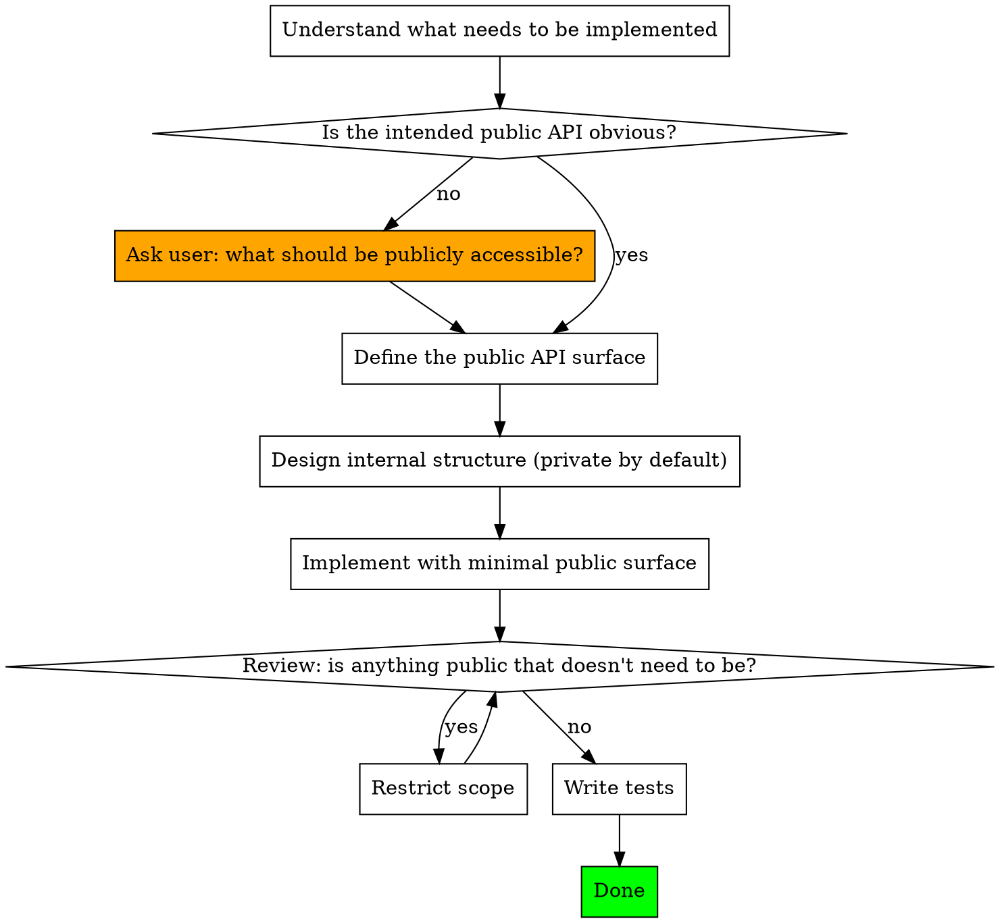

# New Feature Implementation for nJAMS SDK

## Overview

Every `public` or `protected` member you add becomes a permanent commitment to all external client implementations. Default to private. Only promote to public what is explicitly intended as API. If the intended public surface is unclear, ask before planning — not just before coding.

## Hard Rules

**All commits must reference the related Jira ticket** using the Smart Commits format: `SDK-XXX #comment <description>`. If no ticket has been provided for the feature, ask before committing.

**When creating a new Jira ticket** (for a feature that has none yet), always set the `fix version` field to the current working copy's version with the `-SNAPSHOT` suffix stripped — read from the root `pom.xml`. Example: working on `6.0.0-SNAPSHOT` → fix version `6.0.0`.

**Manage the `breaking-change` label on the ticket.** Purely additive features (new methods, classes, overloads) are not breaking — make sure the label is absent. If the feature inadvertently requires changing an existing signature, return type, parameter type, or behaviour, add the `breaking-change` label. Check at the start and again before declaring the feature done.

**Default scope is private.** Every new field, method, and class starts as `private` or package-private. Promote to `public`/`protected` only when there is a clear, intentional reason for external access.

**Clarify the public API before any planning or implementation.** If it is not obvious what callers will need to use from the outside, stop and ask. Do not infer the API surface from implementation needs — those are internal details.

**Interfaces over concrete classes for public types.** If a new type is part of the public API, expose it through an interface or abstract class. Keep the concrete implementation package-private where possible (see `Job`, `Activity`, `Group` as the established pattern).

**Do not publish implementation details by accident.** Helper methods, intermediate state, configuration used only internally — none of these should be `public` even if it would be convenient for testing. Use package-private access and locate tests in the same package if internal access is needed for tests.

## Workflow

## Steps in Detail

**1. Clarify the public API surface and performance context first.**
Before designing or writing anything, identify what external callers will actually need. If this is unclear from the request, ask. Also establish whether the new functionality touches the runtime monitoring path (`logmessage/`, `communication/`, `argos/`) — if so, memory and CPU impact must be considered explicitly before implementation. Questions to answer:
- What methods/types will client implementations call or extend?
- Is the new type itself part of the public API, or just an implementation detail?
- Should it be an interface (extensible by callers) or a concrete class?
- Is this on the runtime monitoring path? If yes, are there design choices with meaningful performance trade-offs to raise with the user?

**2. Define the public interface.**
Write out (or confirm with the user) the public signatures before implementing. This shapes the internal design — not the other way around.

**3. Implement privately by default.**
Scope every new member as `private` or package-private first. Only widen scope when a specific external need requires it.

**4. Use interfaces to separate API from implementation.**
For any public type, consider whether callers need the concrete class or only a contract. If callers only need to call methods on it (not construct it or subclass it), an interface is the right boundary.

**5. Write Javadoc for all public and protected members.**
Every `public` and `protected` class, interface, method, constructor, and field in production code must have a Javadoc comment. Write it alongside the code, not as an afterthought. Document what the member does, its parameters, return value, and any exceptions. Internal members (`private`, package-private) do not require Javadoc. Test code is exempt from documentation and code quality rules.

**6. Update the FAQ if settings are involved.**
If the feature introduces any new settings, update `C:\scm\GitHub\njams-sdk.wiki\FAQ.md` to document the new setting: its purpose, accepted values, and default. Push the wiki change before or alongside the code commit.

**7. Review before finalising.**
Before considering the implementation done:
- Scan every `public` and `protected` member: could it be package-private? Does it have Javadoc?
- Check architecture: does the new code respect the model/logmessage/communication layer boundaries?
- Check quality: are methods focused and named clearly? Is there unnecessary complexity or duplication?
- Check new production files: do they start with the Salesfive copyright header?

## Scope Decision Reference

| Situation | Scope |
|-----------|-------|
| Used only within the same class | `private` |
| Used within the same package or by tests in the same package | package-private (no modifier) |
| Intended extension point for client subclasses | `protected` |
| Intentional API for external callers | `public` |
| New type returned/accepted by a public method | `public` interface; implementation package-private |

## Common Mistakes

| Mistake | Correct Approach |
|---------|-----------------|
| Making methods public "just in case" they're useful | Only publish what has a confirmed external use |
| Making a class public because it's returned publicly | Return an interface; keep the class package-private |
| Using `public` for test convenience | Place test in same package for package-private access instead |
| Designing internal structure first, then deciding what to expose | Define the public API surface first |
| Assuming the caller needs access to implementation details | Ask — callers need behavior, not internals |
| Leaving public/protected members without Javadoc | All public API must be documented — write Javadoc alongside the code |
| New production file missing copyright header | All new production source files must start with the standard Salesfive copyright header (see CLAUDE.md) |
| Reaching for a new library to solve a problem | Use existing dependencies or the standard library first; if a new one is truly needed, ask before adding and check online for the latest version |
| Adding allocations or blocking calls to the runtime monitoring path | Raise performance trade-offs before implementing; keep hot paths lean |
