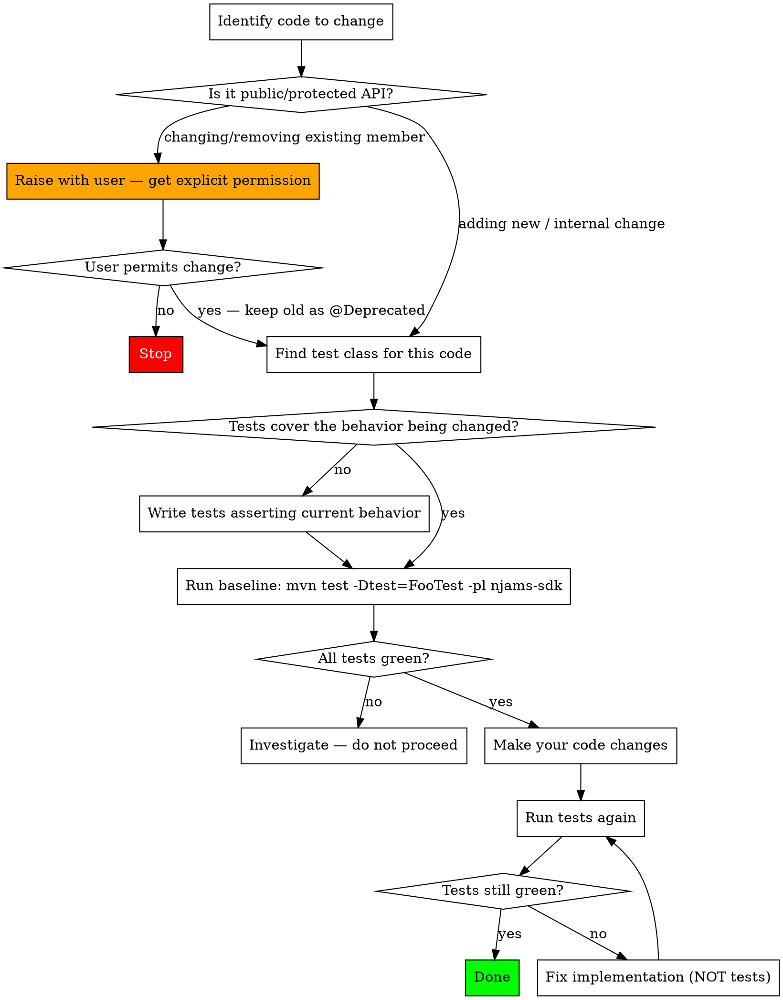

# Safe Code Modification for nJAMS SDK

## Overview

This SDK is a public API with existing external consumers. All existing behavior is implicitly contracted. Before changing any code, establish a test baseline that locks in current behavior. Tests become the specification — they are immutable once written.

## Hard Rules

**Never change existing public API without an explicit user request.** This means: no changes to `public` or `protected` method signatures, return types, parameter types, class names, or observable behavior — even if you think the change is safe or an improvement. If you identify a public API issue, raise it with the user instead of fixing it silently.

**Extending the public API is permitted without explicit request.** New `public`/`protected` methods, classes, or overloads may be added freely. Only *changing* or *removing* existing members requires explicit permission.

**When changing existing public API is explicitly requested**, never remove the old member. Keep it, annotate it `@Deprecated`, and add a Javadoc `@deprecated` tag pointing to the replacement. Delegate to the new implementation where possible:
```java
/** @deprecated Use {@link #newMethod()} instead. */
@Deprecated
public void oldMethod() { return newMethod(); }
```
The deprecated member is still existing code being modified — the full test coverage workflow applies before making any changes to it.

**All commits must reference the related Jira ticket** using the Smart Commits format: `SDK-XXX #comment <description>`. If no ticket has been provided, ask before committing.

**Manage the `breaking-change` label on the ticket.** Since this workflow is about modifying existing code, any modification that touches a public or protected member's signature, return type, parameter type, or observable behaviour is breaking — add the `breaking-change` label. Pure refactors of private/internal code, or purely additive new public members, are not breaking — make sure the label is absent. Check at the start of the modification and again before declaring it done.

**Tests written during this workflow are frozen.** They document what the code does. If your modification breaks one of these tests, fix your code — never the test.

## Workflow



## Steps in Detail

**1. Identify public API surface of the change.**
List every `public` or `protected` member you intend to touch. Distinguish:
- *Adding* a new member → permitted, continue
- *Changing or removing* an existing member → stop and ask the user; if explicitly permitted, keep the old member as `@Deprecated` and delegate to the new one, then continue through the test coverage steps below before making any changes

**2. Find existing tests.**
Tests live in `njams-sdk/src/test/java/com/im/njams/sdk/`. Look for a class named `<ClassName>Test`. Check whether the specific method and behavior you're changing is asserted anywhere.

**3. Add missing tests.**
If the behavior you're changing is not tested, write tests that assert the current observable behavior. Cover:
- Normal/happy-path inputs
- Null or boundary inputs if accepted
- Any branching paths in the code you're modifying

**4. Establish a green baseline.**
```bash
mvn test -Dtest=YourTestClass -pl njams-sdk
```
All tests must be green before you write a single line of modification. If tests are already failing, investigate the cause — do not proceed with changes until you understand why.

**5. Make your changes.**
Implement the requested modification. Do not touch test code. Apply clean code and architecture principles: keep changes focused, respect layer boundaries, use clear naming, and avoid introducing unnecessary complexity. If the change adds or exposes any new `public` or `protected` member in production code, it must have Javadoc. If it deprecates an existing member, the Javadoc must include a `@deprecated` tag referencing the replacement. Documentation and code quality rules do not apply to test code.

**6. Update the FAQ if settings are affected.**
If the change alters a setting's behavior or default, deprecates a setting, or removes one, update `C:\scm\GitHub\njams-sdk.wiki\FAQ.md` and push the wiki change.

**7. Verify the baseline holds.**
```bash
mvn test -Dtest=YourTestClass -pl njams-sdk
```
If any test fails, revert your implementation change and rethink the approach. The test is correct; your implementation is not.

## What Counts as Insufficient Coverage

- The method being changed has no test at all
- The specific code path being modified is not exercised by any test
- Side effects (state changes, messages sent) are not asserted

## Common Mistakes

| Mistake | Correct Approach |
|---------|-----------------|
| Modifying a test to match new behavior | Revert the test; fix the implementation |
| "It's a small change, no need for tests" | Coverage requirement applies to all changes |
| Changing or removing a public member without being asked | Raise it with the user — adding new members is fine, changing/removing is not |
| Removing deprecated old API when adding new replacement | Keep both; mark old one `@Deprecated` with `@deprecated` Javadoc pointing to new |
| Adding a new public member without Javadoc | All public/protected members must have Javadoc — no exceptions |
| Changing a setting without updating the FAQ | Any change to a setting's behavior, default, deprecation, or removal must be reflected in the wiki FAQ |
| Treating a passing build as coverage | Compilation proves nothing; tests assert behavior |
| Writing tests after the change | Tests written post-change just describe what you did, not what the code should do |
