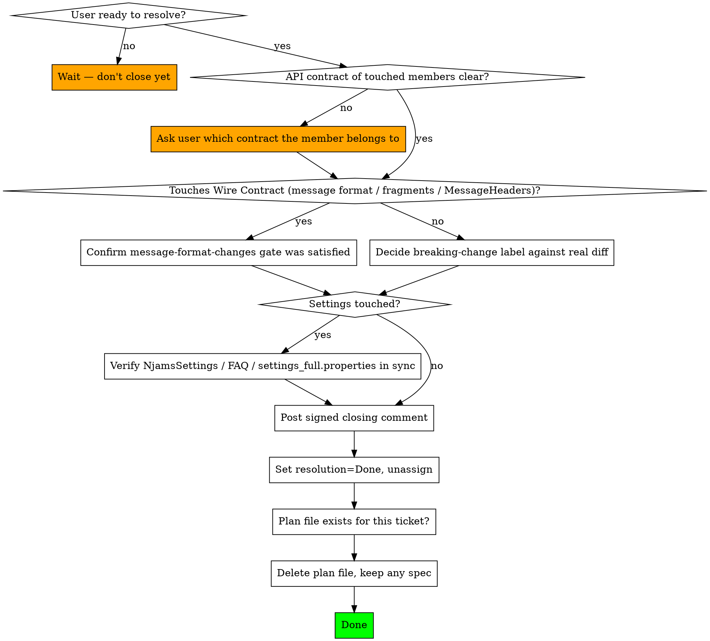

# Ticket Wrap-Up for nJAMS SDK

## Overview

Closing a ticket is the mirror image of `njams-ticket-start`, and it's just as easy to do inconsistently if it isn't checked against a list: the breaking-change label needs an actual decision now that the real diff exists — kickoff deliberately leaves it unset in most cases, so this is usually the first point where the answer is even knowable, not a recheck of an earlier guess. The ticket also needs to actually move to a resolved state, and if the ticket produced a plan file under `docs/superpowers/plans/`, that plan has served its purpose and should go — while any spec for the same ticket stays as permanent reference. Getting this wrong either leaves stale "In Progress" tickets on the board, or clutters Jira with premature closing comments before the user actually wants to resolve anything.

## Hard Rules

**Only run this when the user is actually resolving the ticket** — not just because the code looks finished to you. Verification passing is necessary but not sufficient; wait for the user's go-ahead to close.

**Decide the `breaking-change` label against the actual diff — but only for Client Contract and SPI Contract changes.** In most cases nothing was set at kickoff — treat this as the real decision, not a recheck. Add it if the change touches a public/protected signature, return type, parameter type, or removes/alters observable behavior. Remove it if the change turned out to be purely additive or fully internal (this includes undoing a kickoff-time label, on the rare occasion the ticket description turned out to be misleading). New methods, classes, and overloads are never breaking on their own.

**If the change touches the Wire Contract — the njams-messageformat types, `communication/fragments/`, or `MessageHeaders`/properties — don't decide a `breaking-change` label for it at all.** That contract is governed by `message-format-changes.md`'s human-confirmation + `SER`-ticket gate instead. Before closing, confirm that gate was actually satisfied for this change (a human explicitly confirmed it, and a `SER` ticket exists if nJAMS Server needs a corresponding update) — don't resolve the ticket if it wasn't.

**If the API contract a touched member belongs to is itself unclear, ask — don't guess.** Java `public`/`protected` visibility is not the same thing as public API in this codebase, and public API itself isn't one contract (see `public-api-design.md`): a member can be Internal despite the modifier (e.g. `communication/` plumbing that isn't part of the SPI or Wire Contract), the Client Contract, the SPI Contract, or the Wire Contract — and none of these carry the same breaking-change weight (the Wire Contract doesn't use the label at all). If a touched member doesn't clearly fall into one of these — it's not covered by an existing documented exclusion, and you can't confidently say which contract it belongs to — stop and ask the user which it is rather than picking a label on a guess. Getting this wrong is exactly the failure mode this label exists to prevent.

**Post a closing comment before or as part of resolving**, and keep it brief: state that the issue is resolved and optionally the root cause. Implementation detail belongs in commit messages, not the Jira comment. Every comment posted to Jira must end with:
```
---
_Generated by Claude Code_
```
Write it in Markdown with `contentFormat=markdown` — wiki markup (`h2.`, `_..._`) renders broken.

**Set resolution to `Done` and clear the assignee** as part of the same transition.

**Delete the ticket's plan file only after the ticket is actually resolved, not before.** If `docs/superpowers/plans/` has a `YYYY-MM-DD-sdk-NNN-*.md` file for this ticket, remove it — but only once the resolution transition below has actually happened, since "work has shipped" isn't the same as "ticket resolved." If `docs/superpowers/specs/` has a matching spec, leave it in place permanently — it's kept as reference, not a working document.

**If the ticket touched any settings**, confirm `NjamsSettings`, `wiki/FAQ.md`, and `settings_full.properties` are all in sync before closing — see `njams-settings-sync`. Don't resolve a settings-touching ticket with docs out of sync.

## Workflow



## Steps in Detail

**1. Confirm this is really the close.**
If the user says "looks good" but hasn't said to resolve the ticket, that's not a trigger — keep working or wait.

**2. Place each touched member in its API contract, then decide accordingly.**
This is normally the first real decision on the breaking-change label, not a recheck — kickoff only sets it when the ticket description already made it obvious, which is the exception rather than the rule. For each touched `public`/`protected` member, first confirm which contract it's in (see `public-api-design.md`):
- Internal — not public API at all despite the Java modifier (e.g. `communication/` plumbing that isn't SPI or Wire Contract, or code `public` only for cross-package access)
- Client Contract — the client-facing contract
- SPI Contract — an SPI extension point
- Wire Contract — the njams-messageformat types, `communication/fragments/`, or `MessageHeaders`/properties

If that's genuinely unclear for a given member — it's not covered by a documented exclusion and you can't tell which contract applies — ask the user before deciding anything, rather than picking on a guess.

If the member is in the **Wire Contract**, don't set a `breaking-change` label for it — confirm the `message-format-changes.md` gate was satisfied instead (human confirmation, plus a `SER` ticket if nJAMS Server needs a corresponding change), and hold off resolving if it wasn't.

Otherwise (Internal, Client Contract, or SPI Contract), diff the actual changes against the criteria (signature, return type, or parameter type change; removal; observable behavior change) and set or remove the `breaking-change` label accordingly.

**3. Check settings sync if relevant.**
If any `PROPERTY_*` key changed, was added, or was deprecated, don't resolve until `njams-settings-sync` has been applied.

**4. Comment, then resolve.**
Post the closing comment first (or as part of the same transition, depending on the tool), then set resolution to `Done` and clear the assignee.

**5. Only now, clean up the plan.**
With the ticket actually resolved, find `docs/superpowers/plans/*-sdk-<ticket-number>-*.md` and delete it. Leave `docs/superpowers/specs/*-sdk-<ticket-number>-*` untouched — it's permanent. Don't delete the plan earlier in the sequence — "code shipped" and "ticket resolved" are different things, and the plan should only go once both are true.

## Common Mistakes

| Mistake | Correct Approach |
|---------|-----------------|
| Posting a closing comment because the code feels done | Only post it when the user is actually resolving the ticket |
| Assuming a label (or its absence) from kickoff is already correct | Decide it fresh against the real diff — kickoff only sets it when the ticket description already made it obvious |
| Guessing whether a touched member is really public API when it's ambiguous | Ask the user which contract it belongs to (Internal / Client Contract / SPI Contract / Wire Contract) instead of picking a label on a guess |
| Setting a breaking-change label for a message-format/fragments/MessageHeaders change | That's the Wire Contract — confirm the message-format-changes.md gate instead, don't use the label |
| Resolving without clearing the assignee | Both happen together: resolution=Done and unassigned |
| Leaving the plan file in docs/superpowers/plans/ after the ticket is resolved | Delete it — specs stay, plans don't |
| Deleting the plan file before the ticket is actually resolved (e.g. right after code ships) | Wait until resolution=Done is actually set — merged code isn't the same as a resolved ticket |
| Closing a ticket that changed a setting without checking the FAQ/properties file | Run njams-settings-sync first |
| Writing a long technical closing comment | Keep it to root cause + resolution; details belong in commits |
