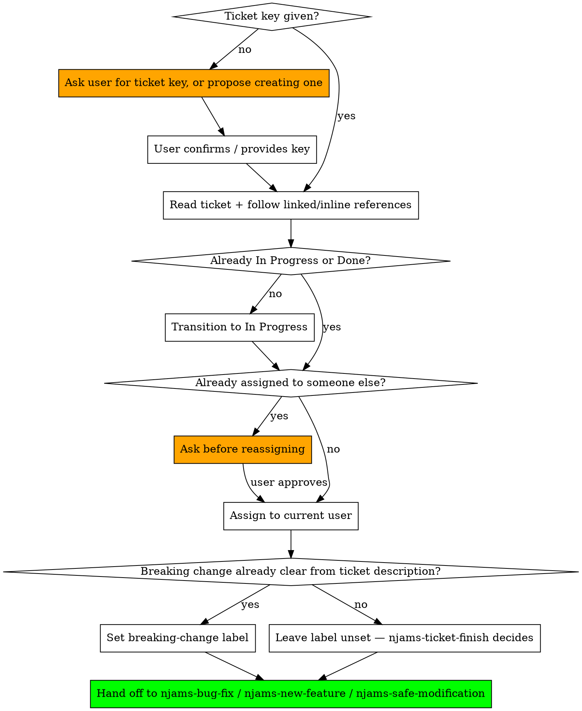

# Ticket Kickoff for nJAMS SDK

## Overview

Every piece of work in this repo traces back to a Jira ticket, and the first few minutes of that work are always the same handful of bookkeeping steps — regardless of whether it turns out to be a bug fix, a new feature, or a refactor. Doing them first, before any code is touched, keeps the ticket's status honest for anyone else looking at the board.

The `breaking-change` label is deliberately *not* part of this bookkeeping in the general case. At kickoff there's usually no diff yet, so guessing at it produces a label that's as likely to be wrong as right — and a wrong label sitting on the ticket is worse than no label, because it looks decided when it isn't. Only touch the label here if the ticket description itself already settles the question; otherwise leave it alone and let `njams-ticket-finish` decide once the real change exists.

This skill only covers the kickoff. Once it's done, hand off to whichever of `njams-bug-fix`, `njams-new-feature`, or `njams-safe-modification` matches the work.

## Hard Rules

**Confirm the ticket key before doing anything else.** If the user hasn't given one, ask for it or offer to create one — never invent a ticket key or proceed without one. Creating a ticket is never something to do on your own initiative; propose it and wait for explicit confirmation.

**Read the ticket, and follow its linked issues.** Check formal issue links ("relates to", "blocks", "is caused by") and also scan the summary, description, and comments for inline references like `SDK-123` mentioned in a sentence — both kinds can carry context or prior decisions that change how you should approach the work.

**Transition the ticket to `In Progress`**, unless it's already in a started or done state.

**Assign the ticket to the current Atlassian user.** Call `atlassianUserInfo` to get the `account_id` and set it as assignee. If the ticket is already assigned to someone else, stop and ask before reassigning — don't silently take over someone else's ticket.

**Do not guess at the `breaking-change` label.** Only set it now if the ticket description itself already makes the answer unambiguous — e.g. it explicitly says "remove deprecated method X" or "change the signature of Y". A ticket that just describes a symptom or a desired capability ("fix NPE in Z", "add support for W") doesn't yet know its own answer; leave the label untouched in that case and defer entirely to `njams-ticket-finish`, which can look at the actual diff.

**If the ticket is being created on the spot**, set its `fix version` to the current `pom.xml` version with `-SNAPSHOT` stripped (e.g. `6.0.0-SNAPSHOT` → `6.0.0`) as part of creation, then run the rest of this kickoff immediately after.

## Workflow

## Steps in Detail

**1. Confirm the ticket.**
If a key like `SDK-123` is already in the conversation, use it. If not, ask the user, or — only with their explicit go-ahead — create one. Never guess.

**2. Read it fully, including what it links to.**
Fetch the ticket and its formal issue links. Also re-read the summary/description/comments text for any inline `SDK-NNN` mentions and fetch those too. A ticket that looks simple can hide constraints decided in a linked ticket months earlier.

**3. Transition and assign.**
Skip this if the ticket is already `In Progress` (or further along) — don't bounce it backwards. Get your own `account_id` via `atlassianUserInfo` before setting assignee.

**4. Only set the `breaking-change` label if the ticket description already makes it obvious.**
If the description explicitly calls for removing or changing an existing public/protected member, set the label now. Otherwise — including whenever you're not sure — leave it alone. `njams-ticket-finish` is the point where this is actually knowable, once the diff exists; setting it here on anything less than certainty just creates a label to un-set later.

**5. Move on.**
Kickoff is done. Continue with the skill that matches the actual work (fixing a defect, adding functionality, or modifying existing code).

## Common Mistakes

| Mistake | Correct Approach |
|---------|-----------------|
| Starting to code before the ticket is even read | Read the ticket and its links first — they may change the approach entirely |
| Reassigning someone else's ticket silently | Ask before taking over a ticket already assigned to another person |
| Guessing at the breaking-change label when it isn't yet knowable | Leave it unset unless the ticket description already makes it obvious; njams-ticket-finish decides for real |
| Creating a Jira ticket without asking | Propose it and wait for explicit confirmation, every time |
| Re-transitioning a ticket that's already In Progress or Done | Check current status first; don't move it backwards |
