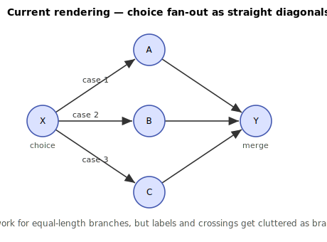

# SDK-452 — Opt-in poly-line process-diagram routing (Spec)

> Status: **Spec / design** for discussion. No production code is written by this document.
> Jira: **SDK-452** (Story). Related: **NJAC-23**.
> A task-by-task implementation plan will follow once this spec and the nJAMS Server compatibility question (see below) are agreed.

## 1. Goal

Provide a **per-client opt-in** process-diagram rendering that routes transitions as **poly-lines** (orthogonal, lane-separated) so that no transition arrow overlaps an activity node or another transition. This solves the reported defect (a stepless bypass edge overlapping the main path) and, with the same mechanism, improves other control-flow shapes such as choice fan-out and convergence.

The current default rendering (`NjamsProcessDiagramFactory` + `CommonBfsModelLayouter`) is **left completely unchanged** and remains the default, so nothing breaks for existing clients.

## 2. Problem

Transitions are currently drawn as straight `<line>` elements between activity centres (`NjamsProcessDiagramFactory.drawTransition`). Whether two arrows overlap is therefore decided purely by where activities are placed. The clearest failure is the **stepless bypass**: a fork `X` with branch `X→A→Y` and a direct edge `X→Y`. The layouter places `X`, `A`, `Y` on the same row, so the straight `X→Y` runs collinearly through `A`:


The same straight-line limitation makes choice fan-out and long (column-skipping) edges crowded or node-crossing as branch counts and lengths grow.

## 3. Goals and non-goals

**Goals**
- Opt-in poly-line rendering, selected per client, additive only.
- No arrow crosses an activity node; parallel/bypass/fan-out edges are visually separated into lanes.
- Reuse the existing activity placement (`CommonBfsModelLayouter`) — the routing operates on already-placed activities.

**Non-goals**
- Changing the default rendering or the default layouter.
- A full general-purpose graph router (global optimal lane assignment, obstacle avoidance for arbitrary cyclic graphs). Scope is the acyclic, grid-placed models the SDK layouter already targets.
- Changing the message format. (The SVG is an interface to nJAMS Server — see §8.)

## 4. Opt-in design (public API)

The SDK already exposes the selection points; no new configuration surface is required:

```java
// default (unchanged): NjamsProcessDiagramFactory + CommonBfsModelLayouter

// opt in to poly-line rendering:
njams.model().setDiagramFactory(new PolylineProcessDiagramFactory(njams));
// optional companion layouter (only if extra channel spacing is wanted):
njams.model().setLayouter(new PolylineProcessModelLayouter());
```

`setDiagramFactory` / `setLayouter` are existing public methods on `NjamsModel` (also reachable via the deprecated `Njams.setProcessDiagramFactory` / `Njams.setProcessModelLayouter`). Selecting the new factory is the entire opt-in.

## 5. New components

| Component | Base | Responsibility |
|-----------|------|----------------|
| `PolylineProcessDiagramFactory` | extends `NjamsProcessDiagramFactory` | **Primary.** Overrides transition rendering to emit routed `<polyline>` edges. Activity/group drawing and SVG plumbing are inherited unchanged. |
| `PolylineProcessModelLayouter` *(optional)* | extends `CommonBfsModelLayouter` | Only if routing needs wider gutters/reserved lanes than the default spacing provides. Activity placement logic is otherwise reused. |

Rationale for subclassing vs. copying: `NjamsProcessDiagramFactory` is already an extension point (`protected` draw methods and constants, `withXslt`). Transition drawing is the one behaviour that changes, so the new factory **overrides `drawTransition`** and reuses everything else. Where a needed seam is `private` today (e.g. `getTransitionCoordinates`), the new class either copies the small piece of logic or we introduce a `protected` routing hook in the base class **without changing its behaviour** (a pure additive refactor, covered by tests via `njams-safe-modification`). The default factory keeps emitting straight `<line>` elements exactly as before.

## 6. Routing model and algorithm

The router works from the activity coordinates the layouter already produced, reconstructing a logical grid (no new cross-layer API):

- **Columns / rows** = distinct sorted activity `x` / `y` bands.
- **Vertical gutters** = the horizontal gap between adjacent columns; carry vertical edge runs in parallel **lanes**.
- **Horizontal channels** = the gap between adjacent rows; carry horizontal detours.
- **Obstacles** = activity/group boxes.


**Per-edge routing rules** (source `S` at `(colS,rowS)` → target `T` at `(colT,rowT)`):

1. **Adjacent, same row** (`colT=colS+1, rowT=rowS`): straight segment (unchanged common case).
2. **Column-skip, same row** (the bypass): exit `S` on its right, drop into a horizontal channel placed **below the label band** (the activity label text sits directly under each icon, so the channel must clear it), run across beneath the intermediate nodes, then come up beside `T` and enter it **from the side** — never vertically from below, which would cross `T`'s label.
3. **Row change** (any column distance): orthogonal elbow — exit `S`, vertical run in the gutter lane, horizontal into `T`. This is what gives fan-out its clean rails.
4. **Fan-out / fan-in**: stagger the exit/entry points across the node's side and assign each edge its own gutter lane so parallel runs never coincide.

**Lane assignment**: group edges by the gutter/channel they traverse; index within the group → distinct offset. Deterministic, sufficient for DAG-shaped models. If a gutter has more edges than lanes, the router **logs** the truncation rather than silently overlapping.

**Rendering**: emit `<polyline points="...">` instead of `<line>`, keeping the existing `modelId`, `markerId`, `name` attributes and the `orient="auto"` arrow marker (which automatically aligns to the final segment).

### 6.1 Transition label placement

Label placement is part of the routing problem, not an afterthought. The current factory centres each transition label at the **geometric midpoint of the straight line** and wraps/truncates it with `wrapLabel`. For routed edges that midpoint is frequently the *worst* spot:

- For a **bypass**, the straight midpoint lands on the intermediate node (`A`) — exactly the collision shown in red below.
- For a **row-changing or elbow** edge, the midpoint can fall on a corner or inside a gutter shared with other edges.
- For **fan-out**, several labels would stack near the source on slanted lines.

Routing rules for labels in the new factory:

1. **Anchor on a clear straight run.** Place the label on the edge's relevant axis-aligned segment (the channel run for a bypass), offset perpendicular to it — never at a corner.
2. **For fan-out / fan-in, hug the unique end and grow into the free space.** A fan-out branch's target-side run is short and lane-dependent, so a centred label spills onto the target. Instead the label is **right-aligned just left of the target** (text-anchor `end`), growing left into the long approach — and **left-aligned just right of the source** (text-anchor `start`) for fan-in. This separates labels by row (each branch ends on its own row) and uses the empty preceding space rather than the cramped corner.
3. **Keep clear of nodes and rails.** Anchoring beside the node (with a small gap) keeps the text off the icon; the row beside a fan-out target is otherwise empty, so the label has room. Reject any candidate whose text box would intersect an activity box.
4. **Reuse existing wrapping/truncation.** `wrapLabel` / `truncateLabel` and the label-suppression rule (`legacyServerCompat`) are reused unchanged.

The visualizations below carry transition labels (`pass` / `skip` / `case n`) so the difference in label placement is visible, not just the arrows.

## 7. Case visualizations

### 7.1 Stepless bypass (the reported defect)

| Current | Poly-line |
|---|---|
|  |  |

The bypass runs in a channel **below the label band** and enters `Y` from the side, so it crosses no node, arrow, or label. Note the labels: in the current rendering the bypass `skip` label sits on `A`; in the routed version it sits on the clear channel run, and the arrowhead no longer lands in `Y`'s label.

### 7.2 Choice fan-out

| Current | Poly-line |
|---|---|
|  |  |

Branches share vertical rails and each travels in its own lane — uniform spacing, no diagonal crossings, room for labels.

## 8. nJAMS Server compatibility ✅ (confirmed)

The generated SVG is an **interface to nJAMS Server** — the server parses these elements to overlay runtime data and to handle interaction. The routed rendering emits `<polyline>` elements for transitions, keeping the same `modelId`, marker and `name` attributes the default `<line>` transitions carry. **This has been confirmed to render correctly on the current nJAMS Server.** The implementation kept `<polyline>` (not `<path>`); the default output is unchanged, so only clients that deliberately enable the routed rendering are affected.

## 9. Public API surface and scoping

- `PolylineProcessDiagramFactory` — `public`, constructed by clients; mirrors `NjamsProcessDiagramFactory(Njams)`. Javadoc required.
- `PolylineProcessModelLayouter` *(optional)* — only created if §11.2 concludes wider routing spacing is needed. If shipped, it is `public` (set via `setLayouter`); otherwise it is not built and adds no API surface.
- All routing internals (grid reconstruction, lane assignment, waypoint computation) — `private` / package-private.
- No relocated/shaded third-party types appear on any `public`/`protected` signature (SVG DOM types are JDK `org.w3c.dom`, already used by the base class).
- Purely additive → **no `breaking-change` label**.

## 10. Testing approach

- **Routing unit tests**: for bypass, fan-out, convergence and long-edge models, assert no edge polyline intersects any activity bounding box, and that edges sharing a gutter occupy distinct lanes.
- **Label-placement tests**: assert each transition label box intersects no activity box, and that labels of edges sharing a channel do not overlap each other.
- **SVG-level tests** (acceptance criterion): render via `PolylineProcessDiagramFactory`, parse the SVG, assert `<polyline>` transitions carry `modelId`/`marker-end` and that the bypass polyline (and its label) avoids the intermediate node's box.
- **Regression**: the default `NjamsProcessDiagramFactory` output is unchanged (existing `NjamsProcessDiagramFactoryTest` stays green; the base class is touched only by additive `protected` hooks under `njams-safe-modification`).

## 11. Open questions

1. ~~**Server compatibility** (§8)~~ — resolved: confirmed working on the current nJAMS Server.
2. **Layouter companion** — resolved for now: the default gutter/channel spacing was sufficient, so `PolylineProcessModelLayouter` was not shipped.
3. **Curved vs. orthogonal** — orthogonal (Manhattan) is implemented; an optional rounded-corner style is cosmetic and can come later.
