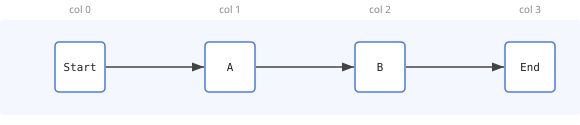
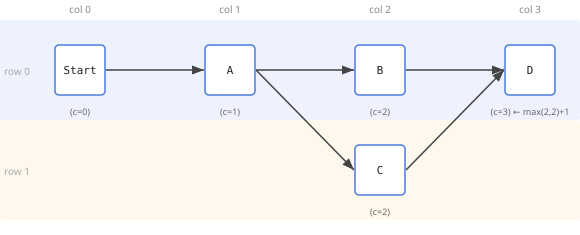
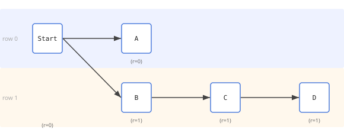
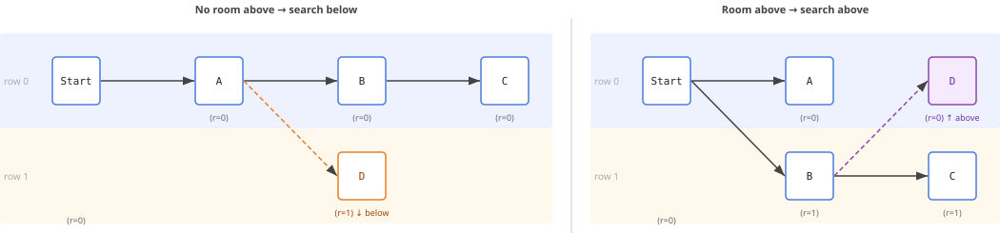
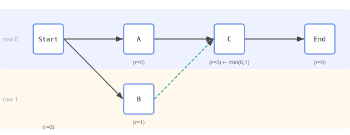
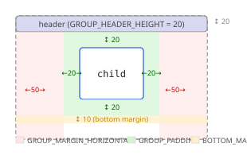
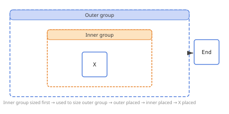

# CommonBfsModelLayouter — Algorithm Documentation

`CommonBfsModelLayouter` assigns absolute `x`/`y` coordinates to every `ActivityModel` and sizes every `GroupModel` to contain its children. It runs in two passes: a depth-first group-sizing pass followed by a top-down placement pass.

---

## Constants

| Constant | Value | Role |
|---|---|---|
| `HORIZONTAL_STEP` | 150 px | Horizontal distance between activity centres in adjacent columns |
| `VERTICAL_STEP` | 100 px | Vertical distance between activity centres in adjacent rows |
| `ACTIVITY_SIZE` | 50 px | Width and height of a plain activity icon |
| `GROUP_PADDING` | 20 px | Padding inside a group between the group border and its children (all sides) |
| `GROUP_HEADER_HEIGHT` | 20 px | Height of the header band drawn above the child area |
| `GROUP_MARGIN_HORIZONTAL` | 50 px | Additional horizontal margin on each side (outside the padding) |
| `GROUP_MARGIN_BOTTOM` | 10 px | Additional margin at the bottom (outside the padding) |

---

## Pass 1 — Group Sizing

Runs depth-first (innermost groups first). Each group's `width` and `height` are computed from a trial layout of its children so that parent groups can in turn be sized correctly.

For a group with a non-empty child layout:

```
group.width  = grid.totalWidth()  + 2 × GROUP_PADDING + 2 × GROUP_MARGIN_HORIZONTAL
group.height = grid.totalHeight() + GROUP_HEADER_HEIGHT + 2 × GROUP_PADDING + GROUP_MARGIN_BOTTOM
```

For an empty group, minimum dimensions apply using `HORIZONTAL_STEP` and `VERTICAL_STEP` instead of the grid totals.

See [Group Layout](#group-layout) for a visual breakdown of the dimensions.

---

## Pass 2 — Placement

For each container (the root process or a group), a column/row grid is computed and absolute coordinates are written to every child activity. The pass then recurses into nested groups.

### 2.1  Column Assignment

BFS from the start activity assigns a column to every node. The **max-column rule** ensures correct placement at convergence points: a node's column is the maximum column among all its predecessors, plus one.

```
column[node] = max(column[predecessor] for all predecessors) + 1
```

This places every node strictly to the right of all predecessors and groups all nodes at the same dependency depth into the same column.

**Linear chain** (`Start → A → B → End`) — each node has one predecessor, so its column is simply the predecessor's column + 1.



**Convergence** — when two branches merge, the join node is placed in the column after the **deepest** predecessor, not just any predecessor, guaranteeing sufficient horizontal space for both incoming paths. `D` has two predecessors, both at column 2, so `max(2, 2) + 1 = 3`. Even if one branch were longer (reaching column 3 while the other is at column 2), `D` would still land at `max(3, 2) + 1 = 4`.



---

### 2.2  Row Assignment

Rows are assigned in **BFS traversal order** (all predecessors are always assigned before any successor, since predecessors are in earlier columns). For each node the algorithm:

1. Computes a **desired row** — the minimum row among its already-assigned predecessors, or `0` if none exist.
2. Resolves **conflicts** — if the desired row is occupied in the target column, it searches for the nearest free row: upward first (`desired − 1`, `desired − 2`, … down to `0`), then downward (`desired + 1`, `desired + 2`, …).

```
predecessors ← invert(successors map from transitions)
occupied     ← Map<col, Set<row>>
rowOf        ← Map<id, row>

for each node in BFS traversal order:
    col        ← columnOf[node]
    preds      ← predecessors[node] ∩ domain(rowOf)   // all assigned predecessors
    desired    ← min(rowOf[p] for p in preds), or 0 if preds is empty
    assigned   ← nearestFreeRow(desired, occupied[col])
    rowOf[node]  ← assigned
    occupied[col].add(assigned)

nearestFreeRow(desired, occupied):
    if desired ∉ occupied → return desired
    for delta = 1, 2, 3, …:
        above = desired − delta
        if above ≥ 0 and above ∉ occupied → return above   // prefer above
        if desired + delta ∉ occupied     → return desired + delta
```

**Inherit predecessor's row.** `Start → A` (row 0) and `Start → B → C → D` (row 1) — a node with a single predecessor and no conflict simply inherits that predecessor's row, so a whole downstream chain stays on the same row once placed.



**Conflict resolution.** When a node's desired row is already occupied in its column, the search goes **upward first**, only falling back **downward** when no free row exists above (down to row 0). Left: `D` desires row 0 (inherited from `A`), but `B` already occupies it and there is no row above `0` — `D` is pushed to row 1. Right: `D` desires row 1 (inherited from `B`), `C` already occupies it, but row 0 is free above — `D` lands there instead.



**Convergence takes the minimum predecessor row.** `C`'s predecessors are `A` (row 0) and `B` (row 1); it desires `min(0, 1) = 0` and lands there, keeping the main flow `A → C → End` unbroken on row 0.



---

### 2.3  Grid Coordinates

After row and column assignment, `x`/`y` coordinates are computed from per-column widths and per-row heights:

```
colWidth[c]  = max width of any activity in column c (ACTIVITY_SIZE for plain activities,
                group.width for GroupModel)
rowHeight[r] = max height of any activity in row r

colX[0] = 0
colX[i] = colX[i-1] + colWidth[i-1] + (HORIZONTAL_STEP − ACTIVITY_SIZE)   // 100 px gap

rowY[0] = 0
rowY[i] = rowY[i-1] + rowHeight[i-1] + (VERTICAL_STEP − ACTIVITY_SIZE)    //  50 px gap

activity.x = originX + colX[column]
activity.y = originY + rowY[row]
```

`(x, y)` is the **top-left corner** of the activity icon. The visual centre is at `(x + ACTIVITY_SIZE/2, y + ACTIVITY_SIZE/2)`.

For root-level activities, `originX = originY = 0`. For children of a group, the origin is offset by the group's position plus its internal margins (see below).

---

## Group Layout

### Sizing formula

Group dimensions are computed bottom-up. The inner grid is computed from the group's children first, then the group box is sized to wrap that grid:

```
group.width  = grid.totalWidth()  + 2 × GROUP_PADDING + 2 × GROUP_MARGIN_HORIZONTAL
group.height = grid.totalHeight() + GROUP_HEADER_HEIGHT + 2 × GROUP_PADDING + GROUP_MARGIN_BOTTOM
```

### Structure



### Child origin

After a group is placed at absolute position `(group.x, group.y)`, its children are placed within it using:

```
childOriginX = group.x + GROUP_PADDING + GROUP_MARGIN_HORIZONTAL
childOriginY = group.y + GROUP_HEADER_HEIGHT + GROUP_PADDING
```

Children then receive their own column/row grid relative to this origin, exactly as root-level activities do.

### Nested groups

The algorithm recurses naturally: a `GroupModel` that itself contains child groups triggers another `sizeGroup` pass (depth-first) and another `placeContainer` call (top-down). Inner groups are sized first so their widths and heights are available when the outer group is computed. This means group nesting of any depth is supported with no special-casing.



---

## Limitations

`CommonBfsModelLayouter` is designed for **acyclic, single-entry process graphs**. The following model shapes are not correctly handled:

### Feedback loops (back-edges)

Transitions that point backward in the flow — from a later activity to an earlier one, forming a loop — are not supported. The BFS traversal visits each activity at most once. A back-edge causes the target activity's column to be updated after it has already been placed, which shifts it to a higher column than intended. The visual result does not represent the loop structure.

**Workaround:** Use `NoopLayouter` and supply coordinates from an external source, or implement a custom `ProcessModelLayouter` that understands your loop structure.

### Self-loops

A transition from an activity to itself is a degenerate cycle. BFS processes the activity and then, when iterating its successors, attempts to update the activity's own column to `column + 1`. Because the activity is already in the visited set it is not re-enqueued, but its column assignment is still incremented — placing it one column further right than intended. Activities after a self-loop may also be shifted.

### Multiple independent entry points

The algorithm roots its BFS at the **first** declared start activity. Activities not reachable from that root are assigned to column 0 as a fallback. If a process has two truly independent execution paths (e.g., two parallel event listeners with no shared start), the second path's activities pile up at column 0 and may overlap with the first path.

**Workaround:** Ensure the model has a single designated start activity that connects (directly or transitively) to every other activity, or use a custom layouter.

### Groups with multiple independent entry points

The same restriction applies inside groups: only the first declared start activity of a group seeds the BFS for that group's interior. If a group has multiple independent entry activities, the secondary entries are treated as unreachable from the BFS root and fall back to column 0 within the group.
