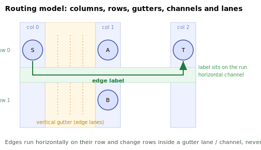
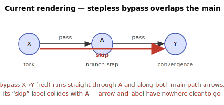
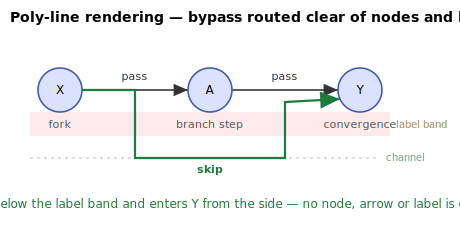
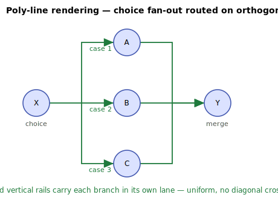

# Poly-line process-diagram routing

`PolylineProcessDiagramFactory` is an **opt-in** alternative to the default `NjamsProcessDiagramFactory`. It renders
transitions as **routed poly-lines** instead of straight lines, so that no transition arrow overlaps an activity icon,
its label, or another arrow.

The default factory draws every transition as a straight line between activity centres. For several common
control-flow shapes that produces overlapping or node-crossing arrows that are hard to read — most visibly a *stepless
bypass* (a direct fork-to-convergence transition with no intermediate activity), but also choice fan-out and
convergence. The poly-line factory routes each edge through the free space between rows and columns to avoid this.

The default rendering is unchanged; you choose the poly-line rendering explicitly per client.

## Enabling it

Set the factory on the `Njams` instance before starting:

```java
njams.model().setDiagramFactory(new PolylineProcessDiagramFactory(njams));
```

Activity placement still comes from the configured `ProcessModelLayouter` (by default
[`CommonBfsModelLayouter`](CommonBfsModelLayouter-Algorithm)); the poly-line factory only changes how the transitions
between the placed activities are drawn. No other configuration is required.

> **Server compatibility:** the routed SVG uses `<polyline>` elements for transitions (carrying the same `modelId`,
> marker and name attributes as the default `<line>` transitions). It is rendered correctly by current nJAMS Server
> versions.

## How routing works

The factory reconstructs a column/row grid from the already-placed activities and routes each transition through the
**gutters** between columns and the **channels** between rows, keeping clear of every activity icon and of the label
text drawn beneath each icon.



Per-edge rules:

- **Adjacent activities on the same row** → a straight segment (unchanged).
- **Stepless bypass** (a same-row edge that skips a column) → the edge leaves the source on its right, drops into a
  channel placed **below the label band**, runs across beneath the intermediate activities, and enters the target
  **from the side** — never vertically from below, which would cross the target's label.
- **Row-changing edges** (fan-out / convergence) → an orthogonal elbow through the column gutter, so each branch travels
  in its own lane.
- Edges that share a gutter or channel are given distinct **lanes** so parallel runs never coincide.

## Examples

### Stepless bypass

| Default (straight) | Poly-line |
|---|---|
|  |  |

With straight lines the bypass `X→Y` runs through the intermediate activity `A` and along the main-path arrows, and its
label collides with `A`. The routed version sends the bypass through a channel below the label band and into `Y` from
the side — no node, arrow or label is crossed.

### Choice fan-out

| Default (straight) | Poly-line |
|---|---|
|  |  |

Branches share vertical rails and each travels in its own lane.

## Transition labels

Transition labels are placed on a clear run of the routed edge rather than at the straight-line midpoint:

- bypass labels sit on the horizontal channel run (below the label band);
- for **fan-out**, each label is right-aligned just left of its target (growing left into the long approach), so labels
  separate by row and never spill onto the target icon;
- for **convergence (fan-in)**, labels are left-aligned just right of their source;
- otherwise the label is centred on the longer horizontal run.

Existing label wrapping/truncation and the server-compatibility label-suppression rule are reused unchanged.

## Limitations

- Designed for acyclic process graphs, like the default layouter. Feedback loops, self-loops and multiple independent
  start activities are not specially handled.
- Transitions whose endpoints are not plain activities of the same container (for example an edge touching a group
  border) fall back to straight-line drawing.
